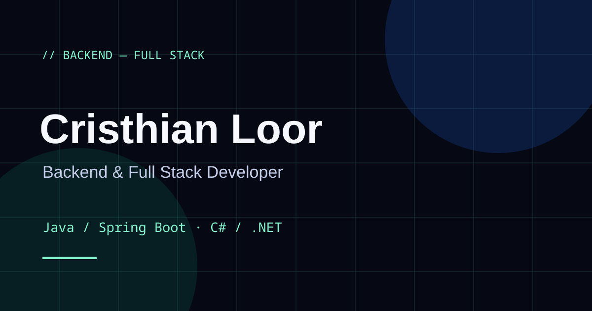

# Cristhian Loor — Portfolio



Portafolio bilingüe de Cristhian Loor, estudiante de Ingeniería de Software en la Universidad de Guayaquil, orientado al desarrollo backend y full stack con Java/Spring Boot y C#/.NET.

**Producción:** https://cristhian-loor.vercel.app/

## Contenido

El portafolio presenta tres casos técnicos reales: **iBatch Financial Operations** (2.º lugar Hackathon UPS × ÉPICO), **Banco Horizonte — Gestión de Reclamos** y **POS API**. Cada caso incluye contexto, problema resuelto, lógica de negocio, decisiones técnicas, arquitectura, stack, funcionalidades verificadas y estado del proyecto.

Disponible en `/es` y `/en` con modo claro y oscuro, navegación responsive, menú móvil accesible, teclado, `prefers-reduced-motion`, SEO por idioma, JSON-LD, `robots.txt`, sitemap e imagen social.

## Stack

- **Frontend:** React 18, Vite, JavaScript, CSS con design tokens, Lucide React.
- **Contenido:** `app/frontend/src/content/es.js` y `app/frontend/src/content/en.js`.
- **Componentes:** `app/frontend/src/components`.
- **Estilos:** `app/frontend/src/styles` (por sección).

## Estructura

```
app/frontend/
├── src/
│   ├── App.jsx              # Compositor de secciones y estado global
│   ├── content/             # Contenido bilingüe (es.js, en.js)
│   ├── components/          # Hero, Projects, TechStack, Methodology,
│   │                        # CareerTimeline, About, Contact, Footer, ...
│   └── styles/              # CSS por sección con design tokens
├── tests/
│   ├── content.test.mjs     # Tests unitarios de contenido
│   └── e2e/                 # Tests de interacción (Playwright)
├── playwright.config.mjs
├── eslint.config.mjs
└── index.html
```

## Rutas

- `/es` — Español (default)
- `/en` — English

## Sistema de demos y repositorios

Las URLs de demo, repositorio y documentación de cada proyecto se configuran desde los archivos de contenido (`src/content/es.js` y `en.js`) en `proyectos[].enlaces`:

```js
enlaces: {
  demo: null,                    // URL pública de la demo o null
  repositorio: 'https://…',      // Repositorio público o null
  documentacion: 'https://…',    // Documentación o null
},
```

- Si una URL es `null`, el botón se muestra deshabilitado con el estado "Demo próximamente" / "Repository coming soon" (accesible mediante `aria-disabled` y `title`).
- Cuando se reemplace `null` por una URL, el botón se activa automáticamente sin modificar componentes.
- `media.portada` y `media.capturas` están preparados para capturas reales en WebP/AVIF.

| Proyecto | Demo | Repositorio | Documentación |
| --- | --- | --- | --- |
| iBatch Financial Operations | Pendiente | https://github.com/cristhianl10/iBatch | Pendiente |
| Banco Horizonte — Gestión de Reclamos | Pendiente | https://github.com/cristhianl10/banco-horizonte-reclamos | Pendiente |
| POS API | Pendiente | Pendiente (repositorio privado) | — |

> Las demos aún no tienen URL pública. Hasta entonces se muestran como "Demo próximamente". No se inventan direcciones.

## SEO

- Metadatos por idioma (`og:url`, `canonical`, `og:locale`, `og:locale:alternate`, `hreflang`, `x-default`) actualizados dinámicamente según la ruta `/es` o `/en`.
- JSON-LD (Person + WebSite) actualizado por idioma.
- Imagen social PNG en `1200×630`: `app/frontend/public/social-card.png`.
- Metadatos esenciales presentes en el HTML inicial (`index.html`).

## Accesibilidad

- `prefers-reduced-motion`, foco visible, `aria-current` en navegación.
- Tabs de proyectos y stack navegables por teclado (ArrowLeft/ArrowRight/Home/End).
- Estado deshabilitado de enlaces pendientes anunciado con `aria-disabled`.
- Contenido sin mezcla de idiomas.

## Pruebas y calidad

### Lint

ESLint 9 (flat config) con `eslint-plugin-react` y `eslint-plugin-react-hooks`.

```bash
cd app/frontend
npm run lint
```

### Tests unitarios

```bash
npm test
```

Cubren: proyectos soportados, CV, rutas, navegación, demo/repos en `null`, idiomas sin mezcla, categorías del stack y ausencia de métricas arbitrarias.

### Tests E2E (Playwright)

```bash
npm run test:e2e
```

Cubren: renderizado del hero, descarga del CV, rutas `/es` y `/en`, cambio de idioma, cambio de tema, selección de proyectos, estado "Demo próximamente", navegación por teclado y menú móvil.

### CI

GitHub Actions (`.github/workflows/quality.yml`) en `push` y `pull_request`: `npm ci` → lint → unit tests → build → E2E tests.

## Desarrollo

```bash
cd app/frontend
npm ci
npm run dev
```

Scripts: `dev`, `build`, `preview`, `lint`, `test`, `test:e2e`.

## Despliegue

Vercel construye `app/frontend` y publica `app/frontend/dist` (`vercel.json`). Los metadatos esenciales están en el HTML inicial y se ajustan al montar cada idioma.